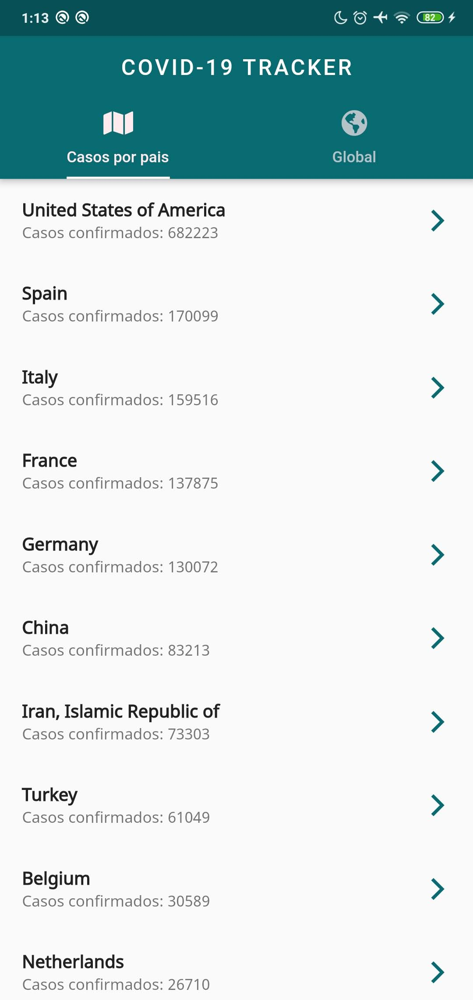
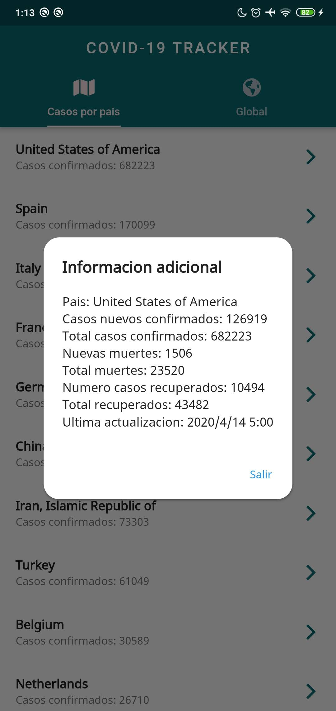
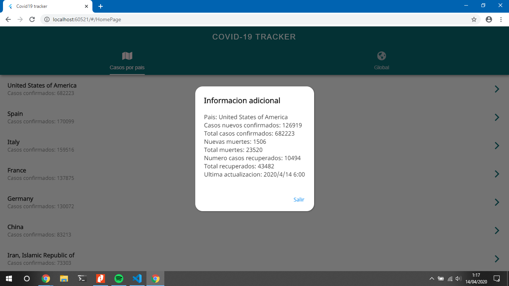
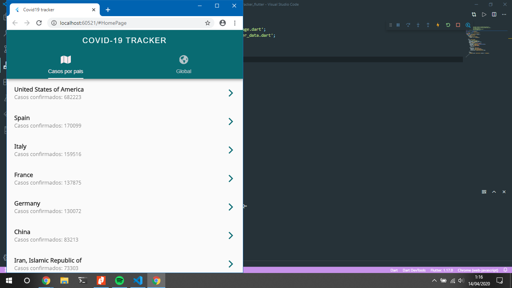

# Covid19 Tracker

Para abrir demo web abre este enlace: https://nestorsgarzonc.github.io/covidstatusWeb

Esta app esta hecha en flutter consumiendo el siguiente
[backend](https://api.covid19api.com)

## Para ejecutar la app has lo siguiente

    - Clona repositorio.
    - En tu terminal de preferencia inserta el siguiente comando: flutter packages get o abrelo en VsCode o Android Studio.
    - Ejecutalo en un dispositivo de tu preferencia.
    - Disfrutalo.

Si deseas ejecutarlo asegurate de estar en algun branch de flutter excepto stable.

### Screenshots

